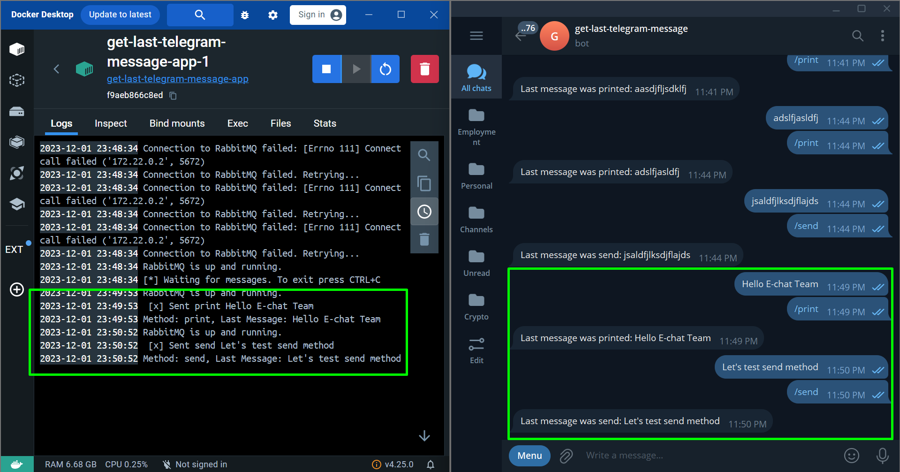

# 🚀 Telegram Bot Message Processor

## 👓 Overview
This Python application is designed to asynchronously process messages from a Telegram bot using RabbitMQ. The application is containerized using Docker for easy deployment and can be configured through environment variables.

## 🛠 Requirements
- Docker

## 🚀 Getting Started

1. Clone the repository:

    ```bash
    git clone https://github.com/eduardhabryd/get-last-telegram-message.git
    cd get-last-telegram-message
   ```

2. Create a Telegram bot and obtain the bot token from BotFather in Telegram. Here are the [instructions](instructions/BOT_SETUP.md).

3. Create a `.env` file in the project root using `.env.example` as a template specifying your `BOT_TOKEN`. You can use 
   all the other details without changes for your convenience.
4. Build and run the Docker containers:
   ```bash
   docker-compose up --build
   ```
5. The application will now start processing messages from the Telegram bot and execute the specified actions based on the received commands.

##  🪟 Demo

